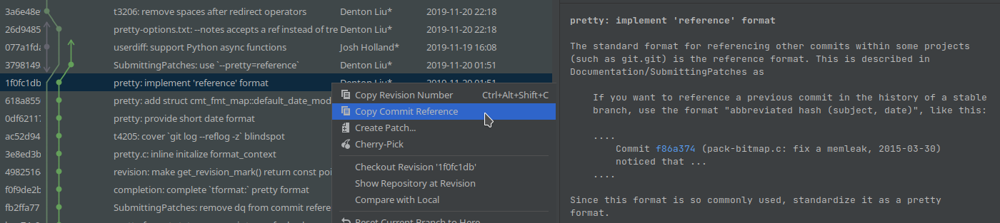

# Copy Commit Reference

Plugin for IntelliJ-based IDEs.

<!-- Plugin description -->
Provides a context menu item "Copy Commit Reference" in all VCS log views. It copies a reference to the commit in
the [same format as `git log --format=reference`](https://git-scm.com/docs/git-log#_pretty_formats).

This format is used to refer to another commit in a commit message.  For example:
[commit `1f0fc1d (pretty: implement 'reference' format, 2019-11-20)`](https://github.com/git/git/commit/1f0fc1db8599f87520494ca4f0e3c1b6fabdf997)
in the git.git repository.
<!-- Plugin description end -->

Source code of the plugin is distributed under the terms of the MIT Licence.
See [LICENSE.txt](LICENSE.txt) for details.

## Installation

Using IDE built-in plugin system (right now – only through alpha release channel):
1. Add alpha channel as a [Custom plugin repository][CustomPluginRepository].
   - Use `https://plugins.jetbrains.com/plugins/alpha/list` as the repository URL.
2. <kbd>Settings/Preferences</kbd> > <kbd>Plugins</kbd> > <kbd>Marketplace</kbd> > <kbd>Search for "Copy Commit Reference"</kbd> >
   <kbd>Install Plugin</kbd>
  
Manually:

Download the [latest release](https://github.com/rybak/intellij-copy-commit-reference/releases/latest) and install it manually using
<kbd>Settings/Preferences</kbd> > <kbd>Plugins</kbd> > <kbd>⚙️</kbd> > <kbd>Install plugin from disk...</kbd>

## Plugin TODO list
- [ ] add action to the context menu of annotations, after action of class
      `CopyRevisionNumberFromAnnotateAction`
    - Not feasible as of IntelliJ 2023.1, because context menu of annotations
      is custom-built.  See [usage of class `CopyRevisionNumberFromAnnotateAction` in
      `AnnotateToggleAction.java`][AnnotateToggleAction]

---
Plugin based on the [IntelliJ Platform Plugin Template][template].

[CustomPluginRepository]: https://www.jetbrains.com/help/idea/managing-plugins.html#repos
[template]: https://github.com/JetBrains/intellij-platform-plugin-template
[AnnotateToggleAction]: https://github.com/JetBrains/intellij-community/blob/master/platform/vcs-impl/src/com/intellij/openapi/vcs/actions/AnnotateToggleAction.java#L199-L202
